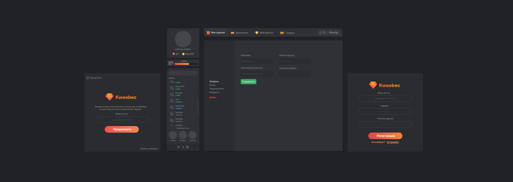

# Kweebec

> Kweebec is a game project that contains own customized server, cross-platform desktop application, blog and so on... We provide to Hytale community our project to enjoy this awesome game together!



# Development

We need to start the server side:

```sh
 cd api
 npm install
 npm start
```

..and almost same with client side:

```sh
 cd app
 npm install
 npm run dev
```

For log in or sign up you'll need internet connection.

Regardless of your account, ui content will be set as mock data by default. If you wanna change it, see below.

#### Well, first of all, clear site cookie! (F12, Application, Cookie, Clear all)

Next.. go to
`app/src/views/Home/Home.js`
find 78 line and replace
`userInfo: mockData`
to
`userInfo: state.auth.userInfo`
